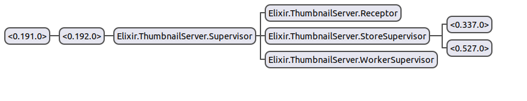

# GenThumbnail
Exploring the actor model, BEAM, OTP and Supervision tree.

`gen_thumbnail` is a set of two applications that create thumbnails (`25%`, `50%` and `200%` version) for a given image.
## Architecture
The `thumbnail_http` project exposes a simple REST API and is based on the awesome (Plug)[https://github.com/elixir-plug/plug] specification.
The `thumbnail_server` project has all the logic for thumbnails creation: a (GenServer)[https://hexdocs.pm/elixir/GenServer.html] `thumbnail_receptor`:
1. Receives the query
2. Starts an (Agent)[https://hexdocs.pm/elixir/Agent.html] (i.e `thumbnail_store`) that stores all the paths to the differents thumbnails of the query
3. Spawn four (Tasks)[https://hexdocs.pm/elixir/Task.html] (i.e `thumbnail_worker`) that create the different thumbnails. Each Task uses a (Port)[https://hexdocs.pm/elixir/Port.html] 
   to launch the linux command `convert` for the creation of the thumbnail.
## Running
`iex -S mix`

# Usage
The application listens on the `8080`port for the requests.
## Submit an image for thumbnails creation
```sh
curl -X POST \
  http://localhost:8080/thumbnails \
  -H 'Content-Type: application/x-www-form-urlencoded' \
  -H 'content-type: multipart/form-data; boundary=----WebKitFormBoundary7MA4YWxkTrZu0gW' \
  -F image=@/home/salmane/Desktop/elixir.png
```
Upon success, `gen_thumbnail` responds with the following payloads:
```sh
{
    "thumbnail_job_id": "0432d218-7641-11e9-b5be-000c293aa689"
}
```

## Retrieve details about a thumbnail creation job
```sh
curl -X GET \
  http://localhost:8080/thumbnails/0432d218-7641-11e9-b5be-000c293aa689 \
```
The following response is returned:
```sh
{
    "min_thumbnail_url": "/thumbnails/25_elixir.png",
    "mid_thumbnail_url": "/thumbnails/50_elixir.png",
    "max_thumbnail_url": "/thumbnails/200_elixir.png"
}
```

## Access thumbnails 
```sh
curl -X GET \
  http://localhost:8080/thumbnails/200_elixir.png \
```
## Supervision tree

